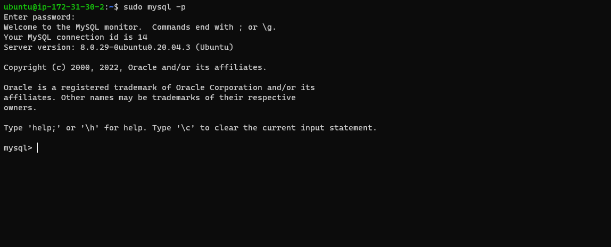

## My PROJECT 2: LEMP STACK IMPLEMENTATION

### STEP 1 – INSTALLING THE NGINX WEB SERVER

#### In order to display web pages to our site visitors, i'm going to employ Nginx, a high-performance web server. I’ll use the apt package manager to install this package.

`sudo apt update`

#### I install Nginx using the command below
`sudo apt install nginx`

#### To verify that nginx was successfully installed and is running as a service in Ubuntu,  I run:

`sudo systemctl status nginx`

#### My server is running and I can access it locally and from the Internet (Source 0.0.0.0/0 means ‘from any IP address’). First, let us try to check how we can access it locally in our Ubuntu shell, run:

`curl http://127.0.0.1:80`

#### running my server on the web using public DNS

`ec2-18-206-173-4.compute-1.amazonaws.com`

## STEP 2 — INSTALLING MYSQL

#### Now that I have a web server up and running, I need to install a Database Management System (DBMS) to be able to store and manage data for my site in a relational database. MySQL is a popular relational database management system used within PHP environments, so we will use it in my project.Again, I use ‘apt’ to acquire and install this software:

`sudo apt install mysql-server`

#### log in to the MySQL console by typing:

`sudo mysql`

#### It’s recommended that I run a security script that comes pre-installed with MySQL. This script will remove some insecure default settings and lock down access to my database system. Before running the script you will set a password for the root user, using mysql_native_password as default authentication method. We’re defining this user’s password as PassWord.1.

`ALTER USER 'root'@'localhost' IDENTIFIED WITH mysql_native_password BY 'PassWord.1';`

#### Exit the MySQL shell with:

`mysql> exit`

#### I Start the interactive script by running:

`sudo mysql_secure_installation`

####  Test if you’re able to log in to the MySQL console by typing:

`sudo mysql -p`

## STEP 3 – INSTALLING PHP

#### I have Nginx installed to serve my content and MySQL installed to store and manage my data. Now I can install PHP to process code and generate dynamic content for the web server.While Apache embeds the PHP interpreter in each request, Nginx requires an external program to handle PHP processing and act as a bridge between the PHP interpreter itself and the web server. This allows for a better overall performance in most PHP-based websites, but it requires additional configuration. I’ll need to install php-fpm, which stands for “PHP fastCGI process manager”, and tell Nginx to pass PHP requests to this software for processing. Additionally, I’ll need php-mysql, a PHP module that allows PHP to communicate with MySQL-based databases. Core PHP packages will automatically be installed as dependencies. To install these 2 packages at once, I run:

`sudo apt install php-fpm php-mysql`

## STEP 4 — CONFIGURING NGINX TO USE PHP PROCESSOR

