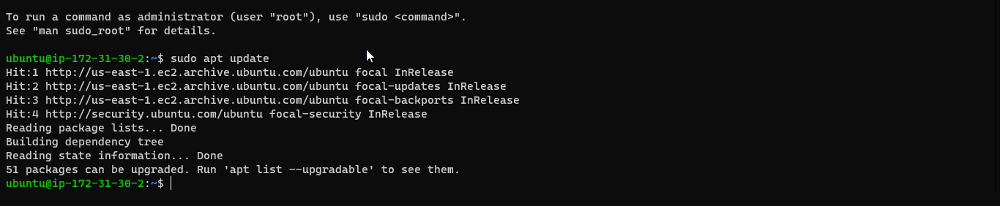

## My PROJECT 2: LEMP STACK IMPLEMENTATION

### STEP 1 – INSTALLING THE NGINX WEB SERVER

#### In order to display web pages to our site visitors, i'm going to employ Nginx, a high-performance web server. I’ll use the apt package manager to install this package.

`sudo apt update`

#### I install Nginx using the command below
`sudo apt install nginx`

#### To verify that nginx was successfully installed and is running as a service in Ubuntu,  I run:

`sudo systemctl status nginx`

#### My server is running and I can access it locally and from the Internet (Source 0.0.0.0/0 means ‘from any IP address’). First, let us try to check how we can access it locally in our Ubuntu shell, run:

`curl http://127.0.0.1:80`

#### running my server on the web using public DNS

`ec2-18-206-173-4.compute-1.amazonaws.com`

## STEP 2 — INSTALLING MYSQL

#### Now that I have a web server up and running, I need to install a Database Management System (DBMS) to be able to store and manage data for my site in a relational database. MySQL is a popular relational database management system used within PHP environments, so we will use it in my project.Again, I use ‘apt’ to acquire and install this software:

`sudo apt install mysql-server`

#### log in to the MySQL console by typing:

`sudo mysql`

#### It’s recommended that I run a security script that comes pre-installed with MySQL. This script will remove some insecure default settings and lock down access to my database system. Before running the script you will set a password for the root user, using mysql_native_password as default authentication method. We’re defining this user’s password as PassWord.1.

`ALTER USER 'root'@'localhost' IDENTIFIED WITH mysql_native_password BY 'PassWord.1';`

#### Exit the MySQL shell with:

`mysql> exit`

#### I Start the interactive script by running:

`sudo mysql_secure_installation`

####  Test if you’re able to log in to the MySQL console by typing:

`sudo mysql -p`

## STEP 3 – INSTALLING PHP

#### I have Nginx installed to serve my content and MySQL installed to store and manage my data. Now I can install PHP to process code and generate dynamic content for the web server.While Apache embeds the PHP interpreter in each request, Nginx requires an external program to handle PHP processing and act as a bridge between the PHP interpreter itself and the web server. This allows for a better overall performance in most PHP-based websites, but it requires additional configuration. I’ll need to install php-fpm, which stands for “PHP fastCGI process manager”, and tell Nginx to pass PHP requests to this software for processing. Additionally, I’ll need php-mysql, a PHP module that allows PHP to communicate with MySQL-based databases. Core PHP packages will automatically be installed as dependencies. To install these 2 packages at once, I run:

`sudo apt install php-fpm php-mysql`

## STEP 4 — CONFIGURING NGINX TO USE PHP PROCESSOR

#### When using the Nginx web server, we can create server blocks (similar to virtual hosts in Apache) to encapsulate configuration details and host more than one domain on a single server. In this, I will use projectLEMP as an example domain name. On Ubuntu 20.04, Nginx has one server block enabled by default and is configured to serve documents out of a directory at /var/www/html. While this works well for a single site, it can become difficult to manage if you are hosting multiple sites. Instead of modifying /var/www/html, I’ll create a directory structure within /var/www for the your_domain website, leaving /var/www/html in place as the default directory to be served if a client request does not match any other sites. Create the root web directory for your_domain as follows:

`sudo mkdir /var/www/projectLEMP`

### Next, I will assign ownership of the directory with the $USER environment variable, which will reference your current system user:

`sudo chown -R $USER:$USER /var/www/projectLEMP`

### I open a new configuration file in Nginx’s sites-available directory using your preferred command-line editor. Here, we’ll use nano:

`sudo nano /etc/nginx/sites-available/projectLEMP`

#### Paste in the following bare-bones configuration:

`#/etc/nginx/sites-available/projectLEMP

server {
    listen 80;
    server_name projectLEMP www.projectLEMP;
    root /var/www/projectLEMP;

    index index.html index.htm index.php;

    location / {
        try_files $uri $uri/ =404;
    }

    location ~ \.php$ {
        include snippets/fastcgi-php.conf;
        fastcgi_pass unix:/var/run/php/php8.1-fpm.sock;
     }

    location ~ /\.ht {
        deny all;
    }

}`

### I Activate my configuration by linking to the config file from Nginx’s sites-enabled directory:

`sudo ln -s /etc/nginx/sites-available/projectLEMP /etc/nginx/sites-enabled/`

#### This will tell Nginx to use the configuration next time it is reloaded. I test my configuration for syntax errors by typing:

`sudo nginx -t`

### I also need to disable default Nginx host that is currently configured to listen on port 80, for this I run:

`sudo unlink /etc/nginx/sites-enabled/default`

### Reload Nginx to apply the changes:

`sudo systemctl reload nginx`

### new website is now active, but the web root /var/www/projectLEMP is still empty. I Create an index.html file in that location so that we can test that your new server block works as expected:

`sudo echo 'Hello LEMP from hostname' $(curl -s http://169.254.169.254/latest/meta-data/public-hostname) 'with public IP' $(curl -s http://169.254.169.254/latest/meta-data/public-ipv4) > /var/www/projectLEMP/index.html`

### Now I go to my browser and open your website URL using IP address:

## STEP 5 – TESTING PHP WITH NGINX

#### At this point, my LAMP stack is completely installed and fully operational. I test it to validate that Nginx can correctly hand .php files off to your PHP processor. I do this by creating a test PHP file in my document root. I Open a new file called info.php within my document root in my text editor:

`sudo nano /var/www/projectLEMP/info.php`

#### I type the following lines into the new file. This is valid PHP code that will return information about your server:

`<?php phpinfo();`

#### I now access this page in my web browser by visiting the domain name or public IP address I set up in my Nginx configuration file, followed by /info.php:

